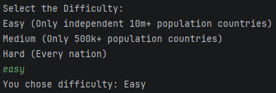
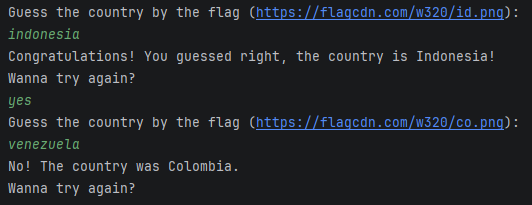

# 🌎 Country Flag Guessing Game 🏳

A small Java console game where the player must guess the country based on its flag.

The game fetches real country data from the **REST Countries API**, filters the available countries based on the selected difficulty, and then randomly selects one for the player to guess.

Example gameplay:




---

## Purpose of the Project

This project was created mainly to practice backend-related Java concepts, including:

- Consuming external APIs
- Parsing JSON responses
- Working with Java Collections
- Using the Stream API for filtering
- Structuring a project using the MVC pattern

The goal was not to build a complex game, but to practice organizing a small application that interacts with real data.

---

## Technologies and Concepts Used

- **Java**
- **REST API consumption** using `HttpClient`
- **JSON parsing** with Gson
- **Java Collections**
- **Stream API**
- **MVC architecture**

The country data is provided by the **REST Countries API**.

---

## Project Architecture

The project follows a simple MVC structure.


com.feliperibas.countrygame \
├─ Main\
├─ controller\
│ └─ GameController\
├─ service\
│ └─ GameService\
├─ view\
│ └─ ConsoleView\
└─ model\
‎ ‎ ‎ └─ Country


### Responsibilities

**Main**

Application entry point. Creates the main components and starts the game.

**GameController**

Controls the game flow and game loop.

**GameService**

Handles the logic of the game:
- fetching data from the API
- converting JSON to `Country` objects
- filtering countries by difficulty
- selecting random countries

**ConsoleView**

Handles interaction with the user through the terminal.

**Country**

Represents the data model for a country.

---

## Running the Project

You can run the game directly using the compiled JAR file.

### 1. Clone the repository


git clone https://github.com/FelipeSantosRibas/country-minigame.git


### 2. Open a terminal in the project folder

Example (Windows):


``` cd country-flag-game ```


### 3. Run the game


``` java -jar country-flag-game.jar ```


The game will start in the terminal and you can begin playing.

---

## Running from an IDE

- Open the project in your preferred IDE (IntelliJ, Eclipse, VSCode, etc).
- Make sure the dependencies inside the `dependencies` folder are added to the project libraries.
- Run:
Main.java
